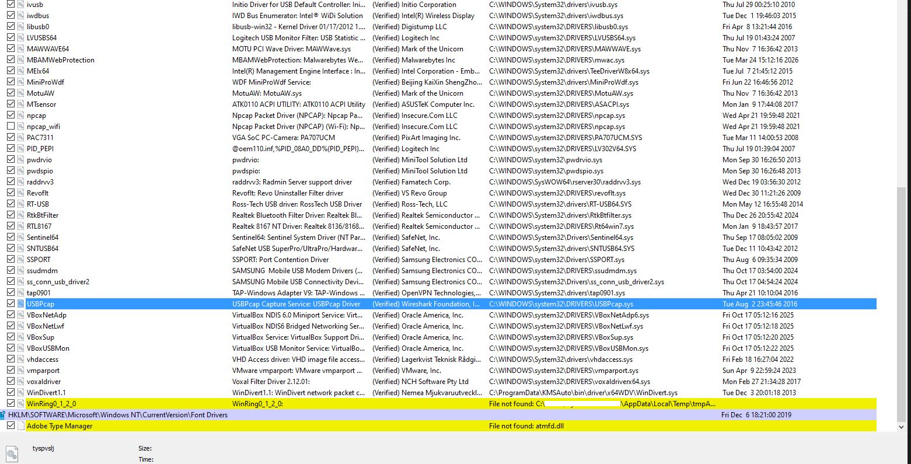

# 🛡️ Incident Response Case Study – WinRing0 Abuse

## 📌 Case Metadata
- **Status:** Resolved
- **Environment:** Windows
- **Focus:** Incident Response / Malware Analysis / Persistence

---

## 🎯 Executive Summary

The root cause was traced to a vulnerable driver (WinRing0) embedded in a legacy hardware monitoring tool.

This case study documents a real-world incident involving persistent malware execution on a Windows system.

The system showed repeated antivirus detections (WinRing0-related), but the threat persisted across reboots. Through behavioral analysis using Sysinternals tools, the root cause was identified as a legitimate application leveraging a vulnerable driver.

The infection was successfully removed without requiring OS reinstallation by identifying and eliminating persistence mechanisms.

---

## 🧠 Key Skills Demonstrated
- Malware analysis (userland + driver abuse)
- Incident response and root cause identification
- Use of Sysinternals tools (ProcMon, Autoruns)
- Persistence analysis (Scheduled Tasks, WMI)
- Practical troubleshooting in a real-world environment

---

## 📌 Overview
This repository documents a real-world malware investigation involving persistent payload execution via a vulnerable driver (WinRing0) on a Windows system.

The infection triggered repeated antivirus detections but persisted across reboots, requiring manual forensic analysis and remediation.

---

## ⚠️ Initial Symptoms
- Repeated Windows Defender alerts (VulnerableDriver:WinNT/WinRing0)
- Temporary `.tmp` files created in user Temp directory
- Malware reappearing after reboot
- No obvious malicious processes visible

---

## 🔍 Investigation Process

### 1. Persistence Analysis
Tools used:
- Autoruns (Sysinternals)

Findings:
- Suspicious scheduled tasks
- References to low-level drivers
- Startup persistence entries

---

### 2. Dynamic Analysis
Tool:
- Process Monitor (ProcMon) with boot logging

Method:
- Filtered for `CreateFile` operations
- Focused on `%Temp%` directory

Key finding:
- Identified parent process:
  PCMeterV0.4.exe

---

### 3. File Validation
Tool:
- VirusTotal

Results:
- Main executable → clean
- Associated DLL → flagged as:
  - Vulnerable Driver
  - HackTool

Conclusion:
A legitimate tool using an unsafe driver was leveraged as an attack vector.

---

## 🧠 Investigation Approach

The investigation followed a behavioral analysis methodology:

1. Identify symptoms (temporary payloads, AV detections)
2. Determine persistence mechanism
3. Trace parent process responsible for file creation
4. Validate binaries using external intelligence (VirusTotal)
5. Remove root cause rather than symptoms

This approach allowed precise identification of the infection source instead of relying on antivirus remediation alone.

---

## 💣 Root Cause
The application used a vulnerable driver (similar to WinRing0), allowing execution of malicious payloads in temporary directories.

---

## 🔗 Persistence Mechanisms
- Scheduled Tasks (`PCMeter`)
- Program Files installation directory
- WMI/WBEM components
- Temporary payload execution

---

## 🧹 Remediation Steps
- Terminated malicious process
- Removed scheduled tasks
- Deleted application directory and associated files
- Cleared WMI-related components
- Cleaned Temp and AppData directories

---

## ✅ Validation
- System rebooted
- No further `.tmp` file creation
- No antivirus detections
- Clean ProcMon and Autoruns output

---

## 🧠 Key Takeaways
- Vulnerable drivers are a critical attack vector
- Antivirus may detect payloads but miss root cause
- Behavioral analysis is essential
- Legitimate software can be abused

---

## 🎯 Outcome
✔ Persistent malware removed  
✔ Root cause identified  
✔ System cleaned without OS reinstall  

---

## 🛠️ Tools Used
- Process Monitor (Sysinternals)
- Autoruns (Sysinternals)
- VirusTotal
- Windows Defender

---

## 📸 Evidence

### WinRing0 Driver Presence

Autoruns revealed a WinRing0-related driver entry associated with a temporary user-space path. This was a strong indicator of vulnerable driver abuse and helped connect the observed Defender detections with the persistence mechanism under investigation.

---

## 🔍 Root Cause Analysis

The investigation revealed that the source of the infection was a legacy hardware monitoring tool (PCMeter).

Using ProcMon, it was observed that:
- `PCMeterV0.4.exe` was actively creating temporary files in the user Temp directory
- These files matched the ones detected and removed by Microsoft Defender

Further analysis showed:
- The executable itself appeared clean
- However, an associated DLL was flagged as a vulnerable driver (WinRing0)

This confirmed that:
- The software included an unsafe driver component
- This component was being abused or flagged due to known vulnerabilities

The persistence mechanism was linked to:
- Scheduled tasks
- Startup entries

Once these were removed, the issue was fully resolved.

---

## 🧠 Lessons Learned

- Legacy utilities can introduce unsafe low-level components that become attack vectors
- Antivirus solutions may remove payloads without eliminating persistence mechanisms
- Process tracing was essential to identify the true parent process behind the infection
